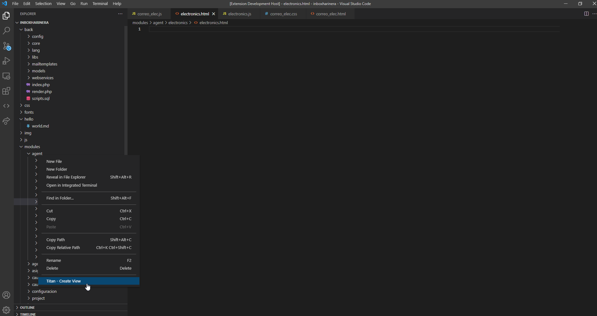

# Titan JS README

This is the README for "Titan JS". Used only if you are working with the Titan core framework.

## Features

Add a menu in the explorer, it allows create the files need to a titan view (.html, .js, .css). 

For example if there is selected a subfolder under your modules folder you will can to create a new view:

## Release Notes

Users appreciate release notes as you update your extension.

### 0.0.3

some problems with directory path was fixed 

### 0.0.2

Commands for run the STD testing were added.

### 0.0.1

Initial release of ...

### For more information

* [Titan js Framework](https://dowesoft.com/page/titancore/)

**Thanks!**
